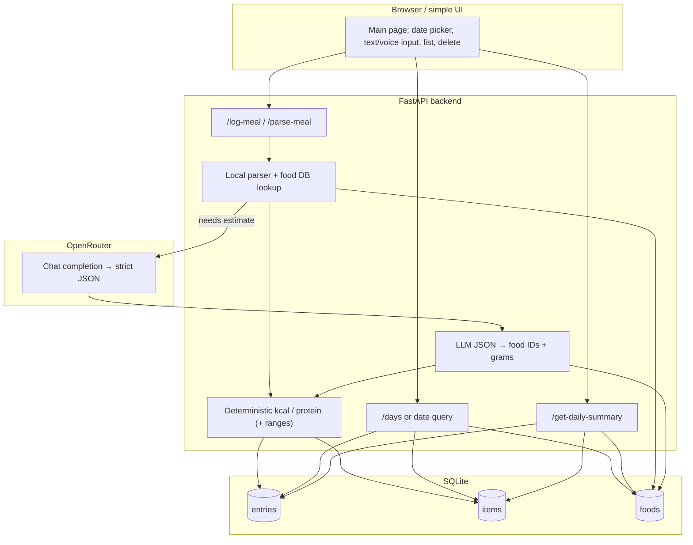
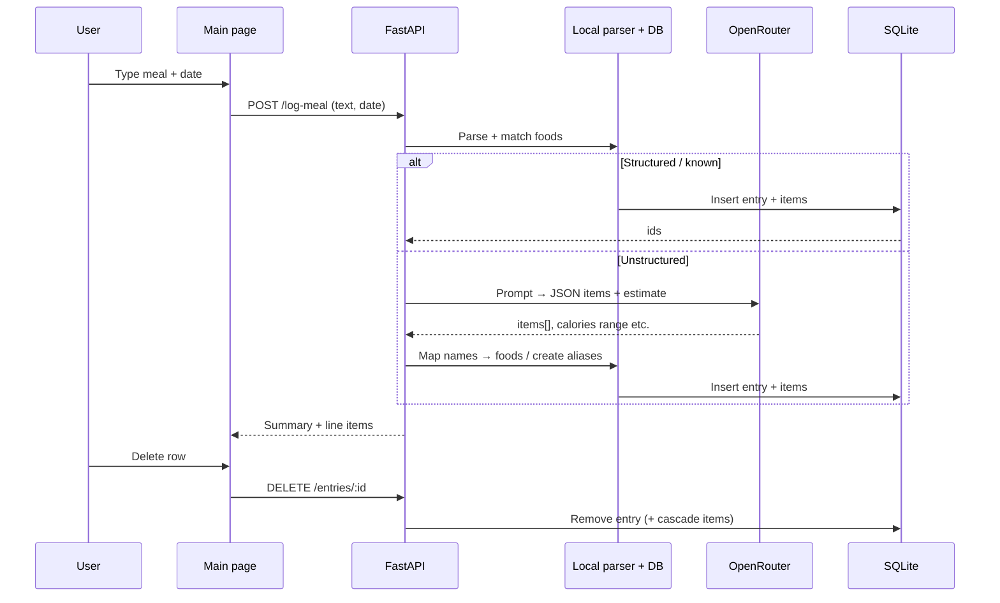

# Hybrid calorie app — architecture

## System context



## Log meal flow



## LLM JSON: calories + uncertainty (for the user)

The goal is **consistent logging**, not perfect accuracy. The LLM should always expose **uncertainty** so the UI can show a believable range (not a false sense of precision).

**Primary signal (required for vague / restaurant-style meals):** a calorie **band** — same idea as in the project rules:

- `calories_likely` — best single number to store and reuse later
- `calories_low` / `calories_high` — plausible bounds
- `estimate_type` — e.g. `"exact" | "estimated" | "range"` (restaurant / vague → usually `"range"`)

**Extra signal (recommended):** explicit **error margin** so users read “about ±X%” without doing math:

- `error_margin_percent` — symmetric margin around `calories_likely` for display, *or* derive from low/high when omitted:  
  `error_margin_percent ≈ max(likely - low, high - likely) / likely * 100`
- `confidence` — optional enum, e.g. `"low" | "medium" | "high"` (how sure the model is about the band, not “nutritional truth”)
- `uncertainty_note` — optional one short sentence in plain language (e.g. “portion size guessed; sauce unknown”)

Example shape (LLM → backend; backend still prefers DB math when items map cleanly):

```json
{
  "items": [
    { "food": "chicken shawarma", "grams": 180 },
    { "food": "laffa bread", "grams": 100 },
    { "food": "tahini", "grams": 30 }
  ],
  "estimate_type": "range",
  "calories_likely": 800,
  "calories_low": 650,
  "calories_high": 950,
  "error_margin_percent": 19,
  "confidence": "medium",
  "uncertainty_note": "Restaurant portions vary; dressing amount unclear."
}
```

**UI:** show something like **“~800 kcal (about 650–950)”** and optionally **“~±19%”** or the short note — enough that users know the number is a **band**, not a measurement.

## Food data sources and bulk import

**Runtime sources (lookup order):** USDA FoodData Central (when `USDA_FDC_API_KEY` is set and not disabled) → Open Food Facts (unless `OPENFOODFACTS_DISABLED`) → `food_baselines` fallback in [`app/off_foods.py`](app/off_foods.py). Successful lookups are cached in SQLite `foods` via [`app/food_resolve.py`](app/food_resolve.py).

**Shipped anchors:** [`app/db.py`](app/db.py) seeds `food_baselines` from `SEED_FOOD_BASELINES` (small curated list). The `foods` table is not pre-filled with a full USDA dump; it grows on demand.

**Bulk tools (offline / maintenance):**

| Tier | Tool | Purpose |
|------|------|---------|
| 1 | [`scripts/import_nutrition_seed.py`](scripts/import_nutrition_seed.py) | Import CSV or JSON into `food_baselines` and optionally warm the `foods` cache — no HTTP. See `--help` and [`data/food_seed.example.csv`](data/food_seed.example.csv). |
| 2 | [`scripts/prefetch_foods_cache.py`](scripts/prefetch_foods_cache.py) | Read query strings (one per line), call `lookup_food` + `resolve_food_row` with rate limiting — needs API keys like the running app. |
| 3 | USDA / OFF public bulk files | Not implemented in-repo; optional future ETL for very large imports. |

**CSV columns (Tier 1):** `name`, `kcal_per_100g`, `protein_per_100g`, optional `food_category`, optional `default_serving_grams`. Header row required. Names are stored lowercased to match app lookups. You can use full FDC-style lines as `name` (e.g. `Orange, raw`) to pre-seed exact autocomplete strings.
